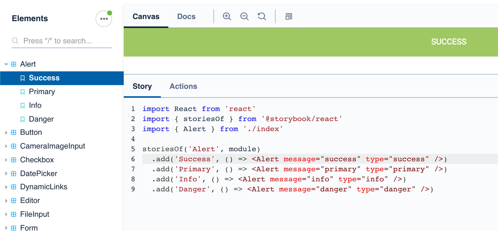

# Web

## Elements

Elements is a React UI Component and utility library we have developed internally and open sourced. The Developer Portal and Marketplace itself uses Elements extensively and if you are building a React app to be installed by clients, we recommend you do too.

The styles are based on the excellent [Bulma UI](https://bulma.io/) library to provide sensible base defaults for common patterns. Although the components themselves are based on React, the project exports a regular stylesheet you can import as normal and markup in your preferred templating language see "What if I don't use React" below. 

In the future, we plan to move away from Bulma to use entirely in-house styles, supporting both Styled Components \(React CSS in JS\) and vanilla CSS. You can keep a track of Elements v2 progress against [this milestone](https://github.com/reapit/foundations/milestone/8).

As well as React Components, we also export a number of useful utilities like form validators, date-time helpers and a HTTP fetch module. 

### Basic Usage

In your terminal, execute;

`yarn install @reapit/elements`

Then insert the stylesheet, either as an import into another stylesheet;

```css
@import '~@reapit/elements/dist/index.css';
```

Or into the head of your document in the normal way.

Then in your code you can either import a component with ES Modules;

```javascript
import { H1, Alert } from '@reapit/elements'
```

Or, using CommonJS

```javascript
const { H1, Alert } = require('@reapit/elements')
```

Then you can use the tags in your code as regular React Components;

```jsx
export const MyCoolComponent = () => {
    return (
        <>
            <H1>Heading!</H1>
            <Alert message="Success!" type="success"/>
        </>
    )
}
```

And that's about it...

### Storybook: Code as documentation

Well, not quite all!

All of the Elements modules are rendered out using [React Storybook](https://storybook.js.org/) and hosted inside the [Developer Portal](https://marketplace.reapit.cloud/developer/elements). If you are not familiar with Storybook as a tool, it allows the developer to interact in live time with the pre-rendered components and their variants. You can adjust the code and see how they behave in live time, as well as providing copy-paste snippets to insert into your project.

When using Storybook, you can toggle between code examples and rendered output of components by using the ‘Canvas’ and ‘Docs’ tabs. You should also toggle the "Show add ons" option from the menu to render the code below the components, and it's variants see below:



In addition to Storybook, because we have used TypeScript throughout out estate, each of our modules ships with TS definitions for free. If you use TypeScript, this is clearly a big help but even if you don't modern IDEs like VSCode will give you intellisense hints about prop types and parameters as you code. 

### What if I don't use React?

Obviously, not everyone uses React and 

## Cognito Auth

## Foundations TS Definitions

Develop in TypeScript against the Reapit Foundations Platform with confidence

If you are using TypeScript \(and we recommend you do!\), for your front end project, we provide full type definitions for the API documented in the [API explorer](https://github.com/reapit/foundations-documentation/tree/db0718c9be27b7760dfae34e69518806acf0e855/developer/swagger/README.md). We generate these types from the Swagger contracts direct so you can be sure that when the API changes, your types will be updated also. This allows for a much closer alignment between front and back end development and ultimately more robust applications.

```
$ give me super-powers
```


The definitions are updated automatically when the API changes. As such, it is recommended strongly that 



```bash
# Ain't no code for that yet, sorry
echo 'You got to trust me on this, I saved the world'
```



## React App Scaffolder

## Web Components

In addition to the Elements React component toolkit, Reapit will soon be offering a number of other downloadable Front End Resources. 

These may be modular blocks of functionality that can be embedded within your site, toolsets or even CMS friendly bundles of scripts available elsewhere. The guiding principles of the project is that the components should be standalone, highly customisable and lightweight. 

These are under active development by our team with an Alpha release in the coming months. You can check on progress [here.](https://github.com/reapit/foundations/milestone/6)

### Search Component

Coming soon...

### Book a Valuation Component

Coming soon...


